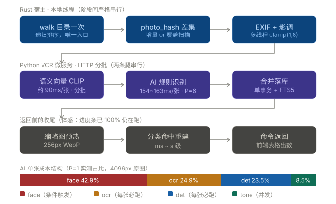

# 批量扫描入库 · 技术现状与性能分析

> **文档定位**：面向「如何优化批量扫描入库」的现状底稿。只描述**当前代码真实在做什么**（含关键代码块与实测数字出处），不做方案设计；方案在最后一节以「入手点 + 证据 + 是否已实测」的形式给出，便于逐条立项。
>
> **代码基线**：分支 `dev-workbubby`，HEAD = `3d18e2d`（增量扫描修复：统一 `photo_hash` 差集判据 + 非 AI 分支落库 + total 语义修正）。
> **实测机型**：AMD Ryzen 7 7840HS（8C/16T，780M 集显）、NVMe SSD、Windows 11。
> **重要说明**：`817ee1e`（FEAT-074 split 双设备流水线：det 留 CPU + face/ocr 进 GPU 单消费者队列）位于 `backup/perf-wip-817ee1e` 分支，**未合入当前 HEAD**，本文按 HEAD 现状描述。

---

## 0. 一页速览

| 项目 | 现状 |
|---|---|
| 入口命令 | `scan_album_combined`（单相册）/ 前端 store 循环调用它（全局批量） |
| 一次扫描的阶段 | walk 目录 → 增量差集 → EXIF → 影调 → 语义向量 → AI 识别 → 合并落库 → 缩略图预热 + 分类重建 |
| 五大处理板块 | ① EXIF 元数据 ② 影调 ③ AI 规则识别（det/face/ocr/tone）④ 语义向量（CLIP）⑤ 落库与派生（SQLite/FTS5/缩略图/分类命中） |
| 涉及的模型 | YOLOv8n-det、SCRFD(det_10g/500m)、ArcFace(w600k_mbf/r50)、PaddleOCR-det(v4)、Chinese-CLIP B/16(fp16/fp32)；影调与 EXIF **无模型** |
| 计算位置 | Rust 侧：EXIF / 影调 / 落库 / 缩略图；Python 微服务(127.0.0.1:8765)：AI 规则识别 + CLIP 全部 |
| 单张耗时（AI 分支，P=6 实测） | 153.9 ms/张（album 32 混合图）· 162.6 ms/张（test 53 大图） |
| 语义向量 | ~90 ms/张（B/16 fp16，CPU） |
| 设备 | **默认全 CPU**（`CPUExecutionProvider` 强制）；DML 未启用；CLIP fp16 档硬性钉死 CPU |
| 可调旋钮 | 批次（8/16/32）、扫描线程数、推理线程数、GPU 开关、语义模型档位、照片并行度 P（仅环境变量） |

---

## 1. 端到端架构

```
┌───────────────── 前端（Vue 3 / Pinia）─────────────────┐
│ ScanPanel.vue        单相册：勾选 basic/tone/person/semantic + 批次  │
│ GlobalScanPanel.vue  全局：勾选 N 个相册，store 内 for 循环串行调用   │
│ ScanPerfSettings.vue ⚙ 扫描性能设置（线程数 + 实测推荐）              │
│ ModelGpuSettings.vue ⚙ 识别性能设置（GPU / 档位 / 推理线程 / 测速）    │
└───────────────────────────┬───────────────────────────┘
                            │ invoke("scan_album_combined", …)
┌─────────────── Rust（Tauri 宿主，src-tauri/src）───────────────┐
│ content.rs::commands::scan_album_combined   ← 总编排              │
│   ├ vision::walk_image_paths        目录只走一遍（spawn_blocking） │
│   ├ photo_hash 差集（增量）· 零变化早退                            │
│   ├ photo_scan::read_exif_paths_parallel   ← 板块①（多线程）      │
│   ├ tone::analyze_paths_parallel           ← 板块②（多线程）      │
│   ├ scan_album_embeddings → HTTP /embed_batch → Python CLIP        │
│   │                                        ← 板块④（分批 HTTP）   │
│   ├ vision::classify_paths → HTTP /classify_batch → Python 规则链  │
│   │                                        ← 板块③（分批 HTTP）   │
│   ├ build_records_* + db::upsert_photo_contents ← 板块⑤           │
│   └ prewarm_thumbs_after_scan + rebuild_semantic_hits              │
└───────────────────────────┬───────────────────────────┘
                            │ HTTP 127.0.0.1:8765
┌─────────────── Python VCR 微服务（python/）────────────────┐
│ server.py（FastAPI）· services/pipeline.py（单张编排）        │
│   det →(条件)face→ ocr  ∥  tone      （两流并行 P-OPT1）      │
│ /classify_batch：ThreadPoolExecutor(P=6) 照片级并行（P-OPT2） │
│ /embed_batch：CLIP vision 塔批量前向                          │
└───────────────────────────────────────────────────────────┘
```

### 1.1 阶段流水线与单张成本结构（总览图）



> 图读法：
> - 上三行是**串行**的三个阶段组，箭头方向即执行顺序，不存在阶段级重叠；
> - 蓝框 = Rust 宿主本地线程，紫框 = Python 微服务（HTTP 分批），灰框 = 命令返回前的收尾；
> - 底部堆叠条是 AI 分支**单张**各通道耗时占比（P=1 实测，30 张 4096px 原图），
>   `det` 与 `ocr` 是「每张必跑」，`face` 由 `_needs_face` 条件触发，`tone` 与 GPU 流并发（不占关键路径）。
> - 收尾两格（缩略图预热 + 分类命中重建）排在命令返回之前 —— 这就是「进度条 100% 但表格还在扫描中」的来源。

**关键结构性事实**：Rust 与 Python 是两个进程，所有 AI/语义算力都在 Python 侧；Rust 只负责文件遍历、EXIF、影调、落库、缩略图。两侧通过 `127.0.0.1:8765` 的 HTTP 通信，**批次即「一批 HTTP 请求的张数」**。

---

## 2. 主流程编排：`scan_album_combined`

位置：`src-tauri/src/content.rs:1342`。全勾四项时的执行顺序（**严格串行，无阶段级并行**）：

| # | 阶段 | 执行方式 | 主要成本 |
|---|---|---|---|
| 0 | 参数校验 + 取消标记复位 | 主线程 | — |
| 1 | `walk_image_paths` 一次遍历 | `spawn_blocking` | 目录 IO（机械盘上明显） |
| 2 | `photo_hash` 增量差集 + 零变化早退 | 主线程 + 短锁查表 | micro 级 stat |
| 3a | EXIF 扫描（`do_basic`） | `spawn_blocking` + N 线程 | 文件打开 + 容器解析 |
| 3b | 影调扫描（`do_tone`） | `spawn_blocking` + N 线程 | 解码 + 直方图 |
| 3c | 语义向量（`do_semantic`） | async HTTP 分批 | CLIP 前向（Python） |
| 3d | AI 识别（`do_ai`） | async HTTP 分批 | det/face/ocr（Python） |
| 4 | 合并记录 + `upsert_photo_contents` | 单事务批量 | SQLite 写 |
| 5 | 缩略图预热 + 分类命中重建 | async | 解码 + 写表 |

### 2.1 阶段 1：目录只走一遍（T10）

历史上 AI/影调/EXIF/语义各自 walkdir 一遍，同一棵树被走 4 次。现在统一一次：

```rust
// content.rs:1394
let all_paths = {
    let dir2 = dir.clone();
    tauri::async_runtime::spawn_blocking(move || crate::vision::walk_image_paths(&dir2))
        .await
        .map_err(|e| format!("目录遍历任务线程失败: {e}"))??
};
```

`walk_image_paths`（`vision.rs:439`）规则：递归子目录、跳过 `.` 开头的隐藏项、只收 `jpg/jpeg/png/webp/gif/bmp`、结果已排序。

### 2.2 阶段 2：增量判据 = `photo_hash` 差集（P8）

```rust
// content.rs:344 —— 唯一判据：路径 + 大小 + mtime（FNV-1a 64）
pub(crate) fn photo_hash(path: &str, len: u64, mtime_ns: u128) -> String {
    let input = format!("{len}|{mtime_ns}|{path}");
    let mut h: u64 = 0xcbf2_9ce4_8422_2325;
    for b in input.as_bytes() {
        h ^= *b as u64;
        h = h.wrapping_mul(0x100_0000_01b3);
    }
    format!("{h:016x}")
}
```

增量模式下用 `db.lookup_scanned_hashes_by_album(album_id)` 取已入库哈希，差集即 `pending`；**覆盖模式下 `pending = all_paths` 全量**。
差集为空 → 直接早退返回（P10），但 `total` 仍填目录真实张数（BUG-2026-0922-008 修复点）。

> ⚠️ 诚实的边界：差集省不掉 walk + stat，只省掉解码（本地耗时的 90%+）。代码注释原文如此。

### 2.3 阶段 3a/3b：本地并行线程数 —— **硬编码，不可调**

```rust
// content.rs:1492  ← 组合扫描用的是这个，不是「性能设置」里那个
let threads_local = std::thread::available_parallelism()
    .map(|n| n.get())
    .unwrap_or(4)
    .clamp(1, 8);
```

`available_parallelism()` = 逻辑核数（7840HS 上为 16）→ `.clamp(1,8)` = **恒为 8**。它**不读** `scan_threads.json`（即 `ScanPerfSettings.vue` 里保存的扫描线程数）。

### 2.4 阶段 3c/3d：两条 HTTP 腿

```rust
// 语义腿（content.rs:1526）
Some(scan_album_embeddings(album_id, user_id, &pending, batch, &app, &state, cancel.clone()).await)

// AI 腿（content.rs:1556）
crate::vision::classify_paths(&paths, batch, &app, Some(cancel.clone())).await?
```

两者**串行 await**，且都打同一个 Python 服务。批次 `batch = batch_size.unwrap_or(8).clamp(4, 64)`。

AI 腿的分批循环（`vision.rs:372`）本质是「一批一批发 HTTP」：

```rust
for chunk in photos.chunks(batch) {
    if cancel.as_ref().map(|c| c.load(Ordering::SeqCst)).unwrap_or(false) { break; }
    let resp: serde_json::Value = client
        .post(format!("{}/classify_batch", vcr_base()))
        .json(&serde_json::json!({ "paths": chunk }))
        .send().await?
        .json().await?;
    // …累加 done/failed → emit "classify-progress"
}
```

> **取消语义**：停止标记只在**批次之间**检查。已发出的一批会跑完；EXIF/影调阶段完全不检查取消（阶段已跑完才轮到它们之后的腿）。

### 2.5 阶段 4：落库所有权（`owns`）

```rust
// content.rs:633
owns: crate::db::FieldGroups {
    ai: true,                  // AI 分支必定产出 AI 字段
    exif: true,                // EXIF 复用第 1 步那一份（P4：不再读第二遍）
    tone: tone_scan.is_some(), // 影调只在本轮跑了才声明拥有
},
```

`upsert_one` 用 `COALESCE / MAX(excluded, 旧值)` 保护未声明拥有的字段组（BUG-2026-0922-005 的修复产物）。
非 AI 分支走 `build_records_from_exif_tone`，`owns.ai = false`，**不会抹掉已有 AI 标签**。

### 2.6 阶段 5：两个「返回前」动作（体感问题来源）

```rust
// content.rs:1689 —— do_ai 成功后预热缩略图
if do_ai && outcome.is_ok() { prewarm_thumbs_after_scan(...).await; }
// content.rs:1701 —— 扫描完成后重建分类命中
if outcome.is_ok() && (do_ai || do_semantic) {
    match crate::category::rebuild_semantic_hits(&app, &state, user_id).await { … }
}
```

两者都在命令返回**之前**执行 → 前端进度条已 100%，但表格仍显示「扫描中」。

---

## 3. 五大板块详解

### 板块① EXIF 元数据（Rust，无模型）

- 实现：`photo_scan.rs::read_photo_exif`，`kamadak-exif` 解析容器。
- 字段：ISO / 焦段 / 光圈 / 快门 / 拍摄时间 / GPS（度分秒→十进制）/ 海拔；拍摄时间三级兜底（DateTimeOriginal → DateTime → GPS-UTC+8）。
- 地点：`geo_index::find_region`（内嵌民政部口径边界，bbox 预筛 + 射线法），**离线、零网络**，万张 <1s。
- 并行：

```rust
// photo_scan.rs:98 —— 按 chunk 数 = 线程数均分，合并后统一排序
pub fn read_exif_paths_parallel(paths: &[std::path::PathBuf], threads: usize) -> Vec<PhotoExif> {
    let n_threads = threads.max(1);
    let chunk_size = paths.len().div_ceil(n_threads).max(1);
    let handles: Vec<_> = paths.chunks(chunk_size)
        .map(|c| c.to_vec())
        .map(|chunk| std::thread::spawn(move || read_exif_paths(&chunk)))
        .collect();
    // …join → flatten → sort_by(file_name)
}
```

- **成本类型**：打开文件 + 解析容器 = 随机小 IO + 少量 CPU，典型「延迟敏感」负载，多线程能真实摊薄 IO 等待。
- **实测**：扫描线程数旋钮有效，14%~27% 提升（来源：项目记忆 2026-09-22 实测；无普适公式，小文件 16~24 线程、大文件 4~6 线程会撞带宽墙）。

### 板块② 影调（Rust，无模型）

- 算法：下采样到 256px → BT.601 整数定点亮度 `(299R+587G+114B)/1000` → 256 bin 直方图 → 平均亮度 L̄ → 分档（`<85` 低调 / `>170` 高调 / 其余中间调）。
- **性能关键是解码**：JPEG 走 `jpeg-decoder` 的 DCT 降采样，只解所需 DCT 块：

```rust
// tone.rs:176
fn decode_sampled(path: &Path) -> Option<image::RgbImage> {
    let is_jpeg = name.ends_with(".jpg") || name.ends_with(".jpeg");
    if is_jpeg {
        let mut decoder = jpeg_decoder::Decoder::new(std::io::BufReader::new(file));
        let _ = decoder.scale(SAMPLE_SIZE as u16, SAMPLE_SIZE as u16); // 256
        let pixels = decoder.decode().ok()?;
        let info = decoder.info()?;
        return image::RgbImage::from_raw(info.width as u32, info.height as u32, pixels);
    }
    let img = image::open(path).ok()?.thumbnail(SAMPLE_SIZE, SAMPLE_SIZE);
    Some(img.to_rgb8())
}
```

- 并行：`analyze_paths_parallel`（`std::thread::scope` 分片，chunk = ceil(n/threads)），与单线程结果逐字段等价。
- **成本类型**：纯 CPU + 独立 IO，零共享状态，天然易并行。

> ⚠️ **重复计算（入手点）**：Python 侧 `tone_service.compute_tone` 为了夜景判定**又算了一遍同样的影调**（`preprocess.resize(256) → numpy BT.601`），与 Rust 侧算法一致但**结果不共享**（`/classify` 请求不携带 tone 数据，见 `tone_service.py` 头部注释）。勾了 tone + person 时，同一张图的影调被算两次。

### 板块③ AI 规则识别（Python VCR）

v5 之后分类模型（yolov8-cls）、Places365、花朵/食物专家通道**已全部下线**，只剩三条规则通道 + 一条条件触发通道：

| 通道 | 模型文件 | 输入 | 触发条件 | 产出 |
|---|---|---|---|---|
| det | `yolov8n-det.onnx`（COCO 80 类） | letterbox 640 | **每张必跑** | 人数 / 最大人框面积 / 车辆数 |
| face_det | `det_10g.onnx` → `det_500m.onnx`（SCRFD） | letterbox 640，(x-127.5)/128 | `_needs_face(det_out)` 为真时 | 人脸框 + 5 点 |
| face_rec | `w600k_mbf.onnx` → `w600k_r50.onnx`（ArcFace） | 112×112 对齐 | 每个检测到的人脸 | 512 维 → person_id |
| ocr | `paddleocr-det.onnx`（ch_PP-OCRv4 det） | letterbox 640 | **每张必跑** | 文字框面积占比 |
| tone | 无模型 | 256px | **每张必跑**（与 det/ocr 并发） | avg_luma |

**条件触发规则**（`pipeline.py:121`，与仲裁器人物分支严格对齐）——省掉「单人小框」的人脸开销：

```python
def _needs_face(det_out) -> bool:
    if not det_out.ready or det_out.count <= 0:
        return False
    n, max_area = det_out.count, det_out.max_area_ratio
    if max_area >= config.PORTRAIT_AREA:            # 0.30 特写
        return True
    heavy_traffic = (getattr(det_out, "vehicle_count", 0) >= config.VEHICLE_HEAVY_N
                     and max_area < config.VEHICLE_PERSON_AREA_MAX)
    if n >= config.STREET_PERSON_N and max_area < config.STREET_MAX_AREA and not heavy_traffic:
        return True                                 # ≥3 人且小框 → 扫街
    if n >= 2 and max_area >= config.GROUP_AREA:    # 0.10
        return True                                 # 合影
    return False
```

**单张内部：两流并行（P-OPT1）**

```python
# pipeline.py:197 —— CPU 流 tone ∥ GPU 流 det→face→ocr
fut_tone = _CHANNEL_POOL.submit(_tone_timed, img)
det_out, ocr_out, face_hits, face_used, gts = _gpu_channels(img, registry, path, use_face)
tone_out, tone_ms = fut_tone.result()
```

`_gpu_channels` 内部仍是串行的 `det → (条件)face → ocr`（face 依赖 det 输出，**不能外提**）。人脸落库用 `_FACE_STORE_LOCK` 串行化（person_store 是「先 match 再写」的读改写，非线程安全）。

**批内：照片级并行（P-OPT2）**

```python
# server.py:307 —— 一个线程一张照片，pool.map 保序
level = max(1, int(config.PHOTO_PARALLEL))          # 默认 6
if level <= 1 or len(paths) <= 1:
    rs = [classify_one(p, registry) for p in paths]
else:
    rs = list(_photo_pool().map(lambda p: classify_one(p, registry), paths))
```

**实测（photo_parallel_bench.py，解码计入，预热 1 轮 + N 轮取最快，交错轮转）**：

| 相册画像 | P=1 | P=2 | P=3 | P=4 | P=6 | P=8 |
|---|---|---|---|---|---|---|
| album 32（1.28~7.26MB 混合） | 282.6 | 201.2 | 172.2 | 158.4 | **153.9** | 151.9 |
| test 53（5.14MB 大图为主） | 352.3 | 238.1 | 199.5 | 181.3 | **162.6** | 152.6 |

默认 P=6（2026-09-23 由 4 修订）：两画像均接近 P=8 峰值（97%/94%），且给宿主 UI/DB 留 CPU 余量。

**通道耗时结构（2026-09-22 实测，30 张 4096px 原图，P=1 口径）**：

| 通道 | 占比 | 备注 |
|---|---|---|
| face | 42.9% | 条件触发，命中率随相册漂移 |
| ocr | 24.9% | **每张必跑** |
| det | 23.5% | **每张必跑** |
| tone | 8.5% | 均值 35.8ms/张；与 GPU 流并发，不占关键路径 |

> P-OPT1 的 Amdahl 上限 = 1/(1-0.085) ≈ **1.09x**，实测 1.07x。并行确实生效，但**上限本身就只有 1.09x** —— 这条路的收益已经吃尽。

### 板块④ 语义向量（Python CLIP）

- 模型：Chinese-CLIP ViT-B/16，两档（`config.CLIP_MODEL_META`）：

| 档位 | 文件 | 体积 | 精度 | 速度 | provider |
|---|---|---|---|---|---|
| `b16`（默认） | `chinese-clip/model_fp16.onnx` → 拆成 `clip_vision/text.onnx` | 377 MB | 零样本 81.1%（53 张标注集） | CPU ~90ms/张（1 万张约 17 分钟） | **恒 CPU**（fp16 在 DML 有算子级数值 bug） |
| `b16-fp32` | `chinese-clip-fp32/model.onnx` | 754 MB | 同权重，数值更精确 | CPU 约 2× fp16；DirectML 实测 37.9ms/张 | 跟随 GPU 开关（默认仍 CPU） |

- 输入：**256px 缩略图**（`THUMB_SIZE = 256`，`thumb_cache` 查表命中优先，缺失现场生成），CLIP 侧再 resize/中心裁剪到 224。
- 批量前向：

```python
# embed_service.py:271 —— 先串行解码整批，再一次前向
for i, p in enumerate(paths):
    img = open_image(p)
    if img is None:
        results[i] = {"path": p, "error": "无法读取图片"}; continue
    pixels.append(clip_tensor(img)); idxs.append(i)
t_dec1 = time.perf_counter()
if pixels:
    out = get_registry().run_clip_vision(np.vstack(pixels))   # (N, dim) 一次性前向
```

> ⚠️ 注释写着「批内分片 ≤8 控制 fp16 峰值内存」，但**代码未分片**，`np.vstack` 一次全上。batch=32 时峰值内存 = 32×3×224×224×4B ≈ 19MB（fp16 图内部另有开销），暂未见 OOM 报告，但与注释不符。

- **批次的唯一真实物理作用域就在这里**：CLIP 图像塔的批量前向。`config.BATCH_CHUNK_MAX = 64`，前端可选 8/16/32。
- 落到 `/embed_batch` 的日志会自动打印解码/推理占比（`take_embed_stats`），用于判断该优化解码还是推理。

### 板块⑤ 落库与派生（Rust / SQLite）

| 动作 | 实现 | 成本 |
|---|---|---|
| 内容库写入 | `db::upsert_photo_contents` → 单事务循环 `upsert_one` | 批量事务，写放大来自 FTS5 触发器 |
| 向量写入 | `db::upsert_embeddings`，**500 条/批** 刷一次事务 | 512 维 f32 BLOB（2KB/张） |
| 缩略图 | `THUMB_SIZE=256`，WebP q85，写 `photo_thumb_cache` | 解码 + 编码，IO 密集 |
| 分类命中 | `category::rebuild_semantic_hits`（关键词向量已缓存） | ms~s 级 |
| FTS5 | `photo_content_fts` 虚拟表；损坏时自愈重建 | 写路径开销 |

---

## 4. CPU / GPU 使用现状

### 4.1 Provider：**默认全 CPU**

```python
# model_registry.py:38 —— 构造即强制 CPU；只有 env VCR_PROVIDER=auto 才自动探测
self._providers_sel: list[str] | None = ["CPUExecutionProvider"]
self._gpu_forced_off = True
if os.environ.get("VCR_PROVIDER", "").lower() == "auto":
    self._providers_sel = None
    self._gpu_forced_off = False
```

- UI 里「🚀 启用加速」（`POST /gpu`）→ `set_gpu_enabled(True)` → 清空全部会话 → 后台按 Dml/CUDA 优先重建。
- **CLIP fp16 档恒 CPU**（`_clip_providers()`：文件名含 `fp16` → `["CPUExecutionProvider"]`），这是规避 BUG-2026-0910-006 的硬钉。
- **DML 现状（2026-09-23 实测，BUG-2026-0923-001）**：780M 集显 + 小模型组合判负 —— P=1 单张 395.4ms 反而慢于 CPU 的 352.3ms；P≥2 并发 run 直接段错误（DML 会话非线程安全）。数值一致性已验证通过（硬字段全一致、conf 5e-3 内）。

### 4.2 ONNX 线程

```python
# model_registry.py:113
def _so(self) -> ort.SessionOptions:
    so = ort.SessionOptions()
    so.intra_op_num_threads = config.threads()   # 默认物理核夹 [4,8]，读 current_threads.json
    so.inter_op_num_threads = 1
    so.graph_optimization_level = ort.GraphOptimizationLevel.ORT_ENABLE_ALL
    so.enable_mem_pattern = True
```

- `config.threads()`：用户持久化优先（`python/models/current_threads.json`），否则 `default_threads() = clamp(物理核, 4, 8)`。7840HS → 8。
- **CLIP 例外**：`_so_clip()` 把图优化降到 `ORT_ENABLE_BASIC`（fp16 图全量优化会在 vision 塔初始化时崩溃）→ **CLIP 吃不到多核，intra 线程旋钮对语义近乎无效**。
- 三层并行共享同一份 CPU 预算：`intra_op 线程 × 照片并行 P × 通道两流`。配置时不要同时拉满。

### 4.3 各阶段的资源占用画像

| 阶段 | 瓶颈类型 | 占 CPU？ | 说明 |
|---|---|---|---|
| walk 目录 | 等 IO | 低 | 机械盘/网络盘上放大 |
| EXIF | 等 IO + 少量 CPU | 中（多线程） | 随机小读 |
| 影调（Rust） | CPU + IO | 中高（多线程） | JPEG DCT 降采样后很快 |
| AI 识别（Python） | **等 HTTP + ONNX 计算** | **高**（P=6 拉满） | 真机观测：16 核总利用率曾仅 ~12%（P=1 时） |
| 语义向量（Python） | **算力**（CLIP CPU 前向） | 高 | BASIC 优化，不吃多核 |
| 落库 | 等 IO（SQLite 事务） | 低 | 单事务批量 |
| 缩略图预热 | CPU（解码+WebP 编码）+ IO | 中高 | 在命令返回前执行 |

### 4.4 实测：CPU / GPU 两模式逐段耗时（2026-09-28）

**口径（先说清楚，否则数字不能跨表比较）**

- harness：`python/bench/bench_cpu_gpu_modes.py`。每轮**独立起一个 VCR 进程**（独立端口 + 独立 `VCR_PHOTO_PARALLEL`），40 张真实照片、批 = 8 张，**第 1 批当预热丢弃**（模型懒加载 + 首次前向），稳态只统计后 4 批（32 张）。
- 客户端计时 = HTTP 往返；服务端段耗时 = `[vcr.stat]`；两者相互印证（一致）。
- Rust 本地段必须 `cargo test --release`：debug 下全尺寸解码被放大约 8 倍（首轮 debug 读数已整轮作废）。
- 各模式**只跑一遍、未交错轮转** ⇒ 跨模式比较只信「量大且方向一致」的差异，个位数百分比按噪声处理。

**表 A · 两条腿总耗时（稳态，ms/张）**

| 轮次 | provider | 照片并行 P | AI 腿 `classify` | 语义腿 `embed` | 备注 |
|---|---|---|---|---|---|
| `cpu-p6` | CPU | 6 | **152.6** | 125.7 | 当前默认配置（最快） |
| `cpu-p1` | CPU | 1 | 368.9 | 122.2 | |
| `gpu-p1` | Dml | 1 | 305.1 | 109.5（复测 125.1） | CLIP 仍 CPU，见结论 4 |
| `gpu-p6` | Dml | 6 | **崩溃** | — | `RemoteDisconnected`，复现 BUG-2026-0923-001 |

> GPU 模式下 `health` 会话表实测：`det/face_det/face_rec/ocr = ['DmlExecutionProvider','CPUExecutionProvider']`，
> 而 `clip_vision/clip_text = ['CPUExecutionProvider']`。

**表 B · AI 腿模型段均摊（ms，稳态批均值，「每张」口径）**

| 段 | 在算什么 | cpu-p1 | cpu-p6 | gpu-p1 |
|---|---|---|---|---|
| decode | 原图解码（纯 CPU） | 76.2 | 136.9 | 70.8 |
| det.pre | YOLO letterbox/resize（纯 CPU） | 63.3 | 70.2 | 50.0 |
| det.run | YOLOv8n ONNX 前向 | 38.8 | 75.8 | **19.4** |
| det.post | NMS + 统计 | 5.1 | 6.1 | 4.1 |
| ocr.pre | PaddleOCR 预处理（纯 CPU） | 58.9 | 109.5 | 53.3 |
| ocr.run | DBNet ONNX 前向 | 49.2 | 111.1 | 41.8 |
| ocr.post | 连通域 **Python 循环** | 1.2 | **38.0** | 1.1 |
| face.pre | 人脸链预处理 | 53.4 | 111.0 | 48.1 |
| face.det | SCRFD ONNX 前向 | 7.8 | 25.5 | **12.2（更慢）** |
| face.post | SCRFD **解码+NMS（纯 Python）** | **176.7** | 199.3 | 119.7 |
| face.align | 5 点对齐 | 37.5 | 63.6 | 34.6 |
| face.rec | ArcFace ONNX 前向 | 5.6 | 11.0 | 6.1（略慢） |
| face.store | 人脸库 match+写入（持锁） | 66.2 | 99.0 | 65.0 |
| tone（并发） | 影调（纯 CPU） | 52.4 | 55.6 | 41.3 |
| clip.fwd | CLIP 图像塔前向（**恒 CPU**） | 116.8 | 119.6 | 103.8 |

> `face.*` 只在人脸命中的图上触发（本样本命中率 0%~62%），故段值按「自己的调用次数」均摊，
> 不是按整批 8 张除——否则会读成假的低值。

**结论（按证据强度排序）**

1. **照片级并行 P 是本机的第一生产力**：cpu-p1 368.9 → cpu-p6 152.6（**2.4×**）。代价是同段「单次调用」被争用抬高（det.run 38.8→75.8），但总吞吐仍大幅胜出。
2. **DML 只在「大一点的前向」上赢**：det.run 38.8→19.4（−50%）、ocr.run 49.2→41.8（−15%）；**小模型反而变慢**：SCRFD face.det 7.8→12.2、ArcFace face.rec 5.6→6.1（DML 每次提交的固定开销盖过算力收益）。
3. **GPU 模式赢不了整体**：gpu-p1（305.1）仍慢于 cpu-p6（152.6），因为 GPU 模式**用不了 P≥2**（并发 run 段错误）。P=1 时 GPU 相对 CPU 只赢 17%（368.9→305.1），远小于 P 带来的 2.4×。⇒ 真命题不是「开不开 GPU」，而是「**GPU + 单消费者队列**（FEAT-074 split 方案）能否既保住 DML 又不丢 P」。
4. **语义腿与 GPU 开关无关**：fp16 档被 `_clip_providers()` 硬钉 CPU（规避 BUG-2026-0910-006），已由会话表证实。gpu-p1 读到 103.8ms/张低于 cpu-p1 的 116.8，但复测（2 批）为 119~124，与 CPU 模式一致 ⇒ **机制未明，按 110~120ms/张 规划，不计入 GPU 收益**。要真吃到 GPU 需切 fp32 档（719MB，跟随开关；config 标注 DML 37.9ms/张）。
5. ~~**单段最大成本是「非 ONNX 的纯 Python」**：face.post 176.7ms/张（SCRFD 解码+NMS 逐 anchor 跑）≈ det.run 的 4.5 倍；ocr.post 在 P=6 下被 GIL 争用从 1.2 放大到 38ms。**这两段是 CPU/GPU 旋钮都救不了的**，只能向量化或换实现。~~ → **✅ 已实施（点 2，见 FEAT-078）**：face.post + det.post 已向量化，同进程 A/B 实测 **SCRFD 解码 116.41 → 0.15 ms/张（784x）**、**YOLOv8 解码 5.12 → 0.43 ms/张（12x）**，输出逐字段等价。
   ⚠️ **但 ocr.post 实测不值得做**：53 张相册上其真实成本只有 **0.94 ms/张**（p50 0.62 / p95 3.07 / max 6.42），连通域 p50=1 / p95=22 / max=52。日志里 40ms 级的 ocr.post 读数是 **GIL 被 face.post 占住造成的放大**，不是真实计算 —— 那只「隐形巨兽」其实是 face.post 的影子。
6. **预处理比推理贵**：decode 76.2 + det.pre 63.3 + ocr.pre 58.9 ≈ **198ms/张**，而四个 ONNX 前向合计 ≈ 101ms/张。⇒ 优化重心应是「一次解码供三条通道复用」，而不是再把模型搬一次家。
7. **影调被算了两遍**：前端默认 `scanTypes = ["basic","tone","person","semantic"]` ⇒ Rust `tone.rs` 跑一遍（写 `tone_type/avg_luma`），Python `pipeline` 的 tone 通道**无条件**再跑一遍（喂仲裁器 `_night_hit` 判「夜景」）。两者算的是同一个 avg_luma：Rust 30.1ms/张（8 线程）+ Python 41~56ms/张（并发、部分被重叠）。

### 4.5 Rust 本地段实测（`--release`，53 张 test 相册）

| 阶段 | 1 线程 | 2 线程 | 4 线程 | 8 线程 | 16 线程 |
|---|---|---|---|---|---|
| walk（一次性） | — | — | — | — | **244 µs / 53 张** |
| EXIF（ms/张） | 0.64 | 0.09 | 0.06 | 0.08 | 0.08 |
| 影调（ms/张） | 67.53 | 60.46 | 42.66 | 30.10 | 17.38 |

- **EXIF 2 线程即饱和**（0.64→0.09），瓶颈是随机小读 IO，加线程无意义。
- **影调是纯 CPU**，但 1→2 线程几乎无收益（60.46 vs 67.53），4→16 才接近线性 ⇒ 单张内部有串行段 + 内存带宽墙。
- 单张诊断：全尺寸解码 **67.0ms**（3712×5568 / 3MB）、降采样分析 **65.2ms**、EXIF **0.41ms**。

---

## 5. 「性能设置」参数地图（优化入手点的落点）

这是本文档最实用的一节：**哪些旋钮真实存在、作用于哪条腿、有没有脱节**。

| 旋钮 | UI 位置 | 落盘 / 端点 | 真实作用域 | 状态 |
|---|---|---|---|---|
| **批次** | ScanPanel / GlobalScanPanel 下拉 8/16/32 | `batch_size` 参数，后端 `clamp(4,64)` | ① AI 腿：一批 HTTP 的张数（**无吞吐收益**，见下）② 语义腿：CLIP 一次前向的张数（**唯一真实批处理收益**） | ✅ 生效 |
| **扫描线程数** | ScanPerfSettings「⚙ 扫描性能设置」 | `get_scan_perf` / `set_scan_perf` / `calibrate_scan_threads`，落 `app_data/scan_threads.json` | **仅 `test_scan.rs`（相册扫描分组工具）** 的 3 处调用 `scan_perf::effective_threads` | ⚠️ **与组合扫描脱节**（见下） |
| **组合扫描本地线程** | 无 UI | 无 | `available_parallelism().clamp(1,8)` → 7840HS 恒 **8** | ❌ 硬编码不可调 |
| **推理线程数** | ModelGpuSettings「CPU 线程数」 | `GET/POST /threads`，落 `python/models/current_threads.json` | ONNX `intra_op`（det/face/ocr）；CLIP 因 BASIC 优化影响很小 | ✅ 生效（但收益有限） |
| **GPU 加速开关** | ModelGpuSettings「🚀 启用加速」 | `POST /gpu`（进程内存，重启回 CPU） | det/face/ocr provider；CLIP fp16 恒 CPU | ⚠️ 本机实测**判负** |
| **语义模型档位** | ModelGpuSettings 档位下拉 | `POST /model`，落 `models/current_clip.json` | CLIP（切换后必须重建语义索引） | ✅ 生效 |
| **照片并行度 P** | 无 UI | 环境变量 `VCR_PHOTO_PARALLEL`（默认 **6**） | `/classify_batch` 线程池大小 | ✅ 生效但不可在 UI 调 |
| **实测工具** | ModelGpuSettings 测速 / 扫档 | `/benchmark`、`/benchmark_sweep` | 固定张量测速、线程扫档 | ✅ 可用 |

### 5.1 明确的三处「脱节/陷阱」

1. **扫描线程数与组合扫描脱节**
   `scan_perf.rs` 提供了 `effective_threads()`（读 `scan_threads.json` + 拓扑推荐 + 实测校准），但只有 `test_scan.rs:763/833/894` 三处调用；`content.rs:1492` 用的是 `available_parallelism().clamp(1,8)`。用户在「⚙ 扫描性能设置」里设的线程数**对 ScanPanel / GlobalScanPanel 的组合扫描完全无效**。

2. **批次对 AI 腿不是吞吐旋钮**
   `/classify_batch` 拿到 N 个 path 后按 P=6 并行跑完；批与批之间不存在重叠，加大 batch 只是减少 HTTP 往返次数。实测「批间空闲 0%」→ 加大批次**无吞吐收益**，其真实定位是内存安全阀。

3. **「测完没效果」的体感来源**
   改线程数/GPU 开关需要**重建会话**才生效，而重建是后台异步的（`/gpu`、`/threads` 立即返回，`/health` 期间 `ok=false`）；CLIP 在 VCR 里是**懒加载**的，`_rebuild_main_chain` 只预热 det。改完设置后 CLIP 仍是下次语义请求才加载 → 体感「没生效」。

---

## 6. 优化入手点（按证据强度排序）

> 标记含义：`[已实测]` 有 benchmark/日志数据支撑 · `[结构性]` 代码事实可直接推出 · `[待验证]` 需要新实验。

| # | 入手点 | 证据/理由 | 预期收益 | 风险 |
|---|---|---|---|---|
| 1 | **组合扫描接上 `scan_perf::effective_threads`** | `[结构性]` 现状硬编码 clamp(1,8)，用户在性能设置里填的值被忽略；`[已实测]` 扫描线程旋钮本身有效（14~27%） | 让已有旋钮真正生效，并允许按相册实测（已按文件大小分层抽样 6~7 档） | 低；注意别把线程数拉到与 Python 侧抢 CPU |
| 2 | **消除影调双算** | `[结构性]` Rust `analyze_paths_parallel` 与 Python `compute_tone` 各算一遍同样的 256px 平均亮度（勾 tone+person 时必双算） | 省掉 Python 侧 tone（实测占串行 8.5%，均值 35.8ms/张，虽与 GPU 流并发但仍是实打实的 CPU 占用） | 需改 Rust→Python 契约（tone 随请求下发）或让 Rust 只写库、Python 读库；注意夜景判定依赖 |
| 3 | **阶段级并行（影调 ∥ 语义向量 ∥ AI 识别）** ✅ **已实施（点 1，见 FEAT-077）** | `[结构性]` 三个阶段严格串行 await，彼此零依赖；`[已实测]` 四类瓶颈类型不同（等 IO / CPU / 算力 / 等 HTTP） | **实测 1.30x**：语义腿 ∥ AI 腿 顺序 9905ms → 并发 7636ms（test 53 · 批 8 · P=6，`bench_cpu_gpu_modes.py --overlap 4`） | ✅ 原文「语义与 AI 共用同一微服务，**不能同时并发**」已被实测证伪：FastAPI 同步端点跑在线程池里，两个请求真并行，ONNX run 释放 GIL；代价是同一份 CPU 预算争用（拿不到理论 max() 的 1.67x） |
| 4 | **ocr/det 条件化** | `[结构性]` det 23.5% + ocr 24.9% ≈ 48% 成本且**每张必跑** | ocr 只在疑似文档时跑（长宽比启发式等）可望砍掉 1/4 成本 | `[待验证]` 会改变 document 召回，需等价性验证（现有 `_needs_face` 是同款改造的成功先例） |
| 5 | **AI 腿改喂缩略图** | `[结构性]` 语义腿已走 256px 缩略图并证明质量可接受；AI 腿仍解 4096px 原图（数十 ms/张） | 解码段大幅下降（P-OPT2 的收益正是来自解码重叠，说明解码占比可观） | `[待验证]` det 小目标（远景人、小字）精度会掉，必须做数值/标签一致性验证 |
| 6 | **语义腿批内并行解码** | `[结构性]` `embed_images` 单线程循环 `open_image + clip_tensor`，只有前向是批量的；日志已把「解码 vs 推理」拆开记 | 解码占比越高收益越大（缩略图解码快，收益可能有限 → 先看 `embed_batch` 日志的解码占比） | 低 |
| 7 | **P 与 intra 的联合调参** | `[已实测]` P=6 是两画像折中；`[结构性]` intra 与 P 共享 CPU 预算 | 大图相册 `VCR_PHOTO_PARALLEL=8` 可再榨 ~2~7% | 宿主 UI/DB 会被抢；`[已实测]` P=8 时 ocr 均摊从 208→377ms |
| 8 | **把 P / 组合扫描线程数做成 UI 可调 + 自动实测** | 现有 `calibrate_scan_threads` 已实现「分层抽样 + 多档实测 + 达峰值 95% 最小档」选优 | 降低用户调参门槛，让推荐值贴合相册画像 | 中；需要一个可复用的实测框架（`calibrate` 目前只测 EXIF 扫描） |
| 9 | **prewarm / 分类重建移出命令返回路径** | `[结构性]` 两者在 `scan_album_combined` 返回前 await → 进度条 100% 但 UI 仍「扫描中」 | 纯体感修复，不改吞吐 | 低；需保证后台任务失败不影响已入库结果 |
| 10 | **GPU 路线（fp32 + DML）** | `[已实测]` DirectML 37.9ms/张 vs fp16 CPU 90ms/张（2.4x）；数值一致性已验证 | 语义腿可望提速 2x 以上 | 前置条件未满足：DML 会话并发 run 段错误（BUG-2026-0923-001）→ 必须先做「GPU 会话进程内串行锁」；且集显+小模型对 det/ocr 判负 |
| 11 | **全局扫描的相册间并行** | `[结构性]` store 里 `for` 循环 `await invoke` 串行 | 仅在「多个小相册 + 单相册填不满 P」时有意义 | `[待验证]` 所有相册打同一个 Python 微服务，收益大概率被服务端串行化吃掉 |
| 12 | **增量粒度细化** | `[结构性]` 目前只到「相册级差集」；语义腿另有「同档位向量差集」 | 已是主要收益来源，进一步收益在「按板块分别记增量」（例如只勾 tone 时不必重跑已入库的 EXIF） | 中；需扩展 `owns` 之外的「已做过」记账 |

---

## 7. 关键代码块索引

| 关注点 | 文件:行 | 说明 |
|---|---|---|
| 总编排 | `src-tauri/src/content.rs:1342` | `scan_album_combined`，阶段顺序与取消检查点 |
| 增量判据 | `src-tauri/src/content.rs:344` | `photo_hash`（len+mtime+path） |
| 差集与早退 | `src-tauri/src/content.rs:1417-1488` | 增量/覆盖分流、零变化早退 |
| 本地线程数 | `src-tauri/src/content.rs:1492` | `available_parallelism().clamp(1,8)` |
| 落库所有权 | `src-tauri/src/content.rs:633` | `FieldGroups{ai,exif,tone}` |
| AI 分批循环 | `src-tauri/src/vision.rs:372` | `chunks(batch)` → HTTP → 批次间查取消 |
| 语义分批循环 | `src-tauri/src/vision.rs:2181` | 同上，`/embed_batch`，带重试与「响应缺 results 显式报错」 |
| 目录遍历 | `src-tauri/src/vision.rs:439` | `walk_image_paths`（唯一入口） |
| EXIF 并行 | `src-tauri/src/photo_scan.rs:98` | `read_exif_paths_parallel` |
| 影调并行 + DCT 降采样 | `src-tauri/src/tone.rs:89` / `:176` | `analyze_paths_parallel` / `decode_sampled` |
| 单张两流并行 | `python/vcr/services/pipeline.py:197` | tone ∥ det→face→ocr |
| 人脸条件触发 | `python/vcr/services/pipeline.py:121` | `_needs_face` |
| 批内照片并行 | `python/server.py:307` | `ThreadPoolExecutor(PHOTO_PARALLEL)` |
| CLIP 批量前向 | `python/vcr/services/embed_service.py:271` | 串行解码 + 一次 `np.vstack` 前向 |
| ONNX 会话选项 | `python/vcr/model_registry.py:113` | `intra_op = config.threads()` |
| provider 强制 CPU | `python/vcr/model_registry.py:38` | `_providers_sel = ["CPUExecutionProvider"]` |
| CLIP provider 钉死 | `python/vcr/model_registry.py:237` | `_clip_providers()` fp16→CPU |
| 扫描线程拓扑/推荐 | `src-tauri/src/scan_perf.rs:174` | `compute_recommended`（HDD 压到 ≤4） |
| 性能设置前端 | `src/components/ScanPerfSettings.vue` | 线程数 + 实测推荐 |
| 识别性能前端 | `src/components/ModelGpuSettings.vue` | GPU / 档位 / 推理线程 / 测速 |

---

## 8. 观测口径（优化前后都要看同一份数）

| 日志 | 来源 | 能看到什么 |
|---|---|---|
| `[vcr.stat] classify_batch 批=N张 P=6 总=…ms 均摊 …ms/张 \| decode … det … tone …(并发) ocr … face …(命中 x%) arb … \| wall: gpu … 等tone …` | `server.py:334`（Python stderr → Rust 转存 app.log） | **单张成本结构**：谁占大头、tone 是否已被完全重叠（wall_wait≈0）、face 命中率 |
| `[vcr.stat] embed_batch 批=N张 \| call=.. 解码合计 …ms(x%) 推理合计 …ms(y%) \| 解码均摊 …ms/张` | `embed_service.py:60` | 语义腿该优化解码还是推理 |
| `[scan.incr] album=… 增量模式 \| 目录 N 张 · 待处理 M 张 · 跳过 K 张` | `content.rs:1453` | 增量是否真的生效 |
| `[scan.incr] album=… 向量 \| 输入 N · 待编码 M · 已有同档位向量跳过 K · 缩略图失败 F` | `content.rs:1091` | 语义腿独立归因（不与相册级报告混） |
| `[scan.timing] album=N 全量/增量 \| 目录N张 \| 总 …ms \| walk … · 差集 … · EXIF …(8线程) · 影调 …(8线程) · 语义向量 … · AI识别 … · 构建+落库 … · 缩略图预热 … · 分类重建 … \| 未计入 …` | `content.rs`（`scan_timing.rs::ScanTiming`） | **相册级板块耗时**：每个板块各花多少，末尾的「未计入」是调度/序列化/await 排队残差 |
| `[scan.batch] classify/embed 批 i/N · n张 · …ms · 均摊 …/张` + `… 汇总 · N批 M张 · 合计 … · 批最快 … · 批最慢 …` | `vision.rs` 两个批次循环 | **批次级耗时**：批间抖动（最快/最慢差距大 ⇒ 服务端或 IO 不稳）；批数 >30 时只打首末 + 采样批 |
| `[vcr.stat] classify_batch 模型段均摊 P=6 \| det x120(pre …/run …/post …) · ocr x120(…) · face x48(pre …/det …/post …/align …/rec …/store …)` | `server.py`（`vcr/timing.py`） | **模型段级**：每个模型的预处理 / ONNX 前向 / 后处理各多少；`x次数` 暴露条件触发通道的真实触发率 |
| `[vcr.stat] embed_batch 模型段均摊 \| clip x120(open …/pre …/fwd …)` | `embed_service.py` | 语义腿：PIL 解码 / 预处理 / 图像塔前向；`open` 偏高 ⇒ 缩略图没命中在解原图 |
| `[model.device]`、`/health` 的 `provider=… sessions=det=[..] clip=[..]` | Python 每次会话创建 + health_digest | **「GPU 开了没生效」的铁证** |

### 8.1 细粒度计时怎么用（三层口径不要混）

| 层级 | 前缀 | 回答的问题 | 均摊口径 |
|---|---|---|---|
| 相册级 | `[scan.timing]` | 这次扫描各板块花了多少 | 直接读绝对值（一次扫描一段） |
| 批次级 | `[scan.batch]` | 批与批之间是否抖动、HTTP 往返占多少 | `合计 / 张数` |
| 模型段级 | `[vcr.stat] … 模型段均摊` | 某通道内部是预处理、前向还是后处理贵 | **每段自己的调用次数**（`x次数`）——人脸这类条件触发通道不能用整批张数去除，否则会把「只有 40% 的图跑了」读成「每张只花一点」 |

记账实现的三条纪律（改代码前请先读 `scan_timing.rs` 与 `vcr/timing.py` 的模块头注释）：
1. **纯记账**，不参与任何判断分支，失败最多少一行日志；
2. 格式化 / 汇总抽成**纯函数**并单测（`cargo test --lib scan_timing`，8 例）；
3. Python 侧累加器带锁，但**锁只包住累加那一行，绝不包住推理** —— 否则测出来的是串行推理，数据作废。

**基准方法学纪律（项目已固化，别违反）**：交错轮转、基准进程串行、样本 ≥2000、不用 Python 代理（差 30 倍）；预热 2 轮 + 5~7 轮取最快；耗时与「处理张数」必须成对绑定更新，**绝不跨轮次拼接读数**。

---

## 9. 附：当前已知的功能性缺陷（影响优化判断）

优化前建议先确认这些是否已修，否则性能数字会被污染：

- **假增量清单**：影调 / EXIF / prewarm 目前是**全量**跑（`overwrite=false` 时它们仍吃 `pending` 差集，但 prewarm 对全批做），只有 AI 与图像向量尊重 `overwrite` 语义。
- **停止语义不完整**：`stopCombinedScan` 里 `scanId += 1` 会把已落库结果整个丢掉；后端取消检查点只在批次循环，EXIF/影调阶段后失效。
- **`rebuild_text_index` 扫描后从不自动调用**（只有分类命中的 `rebuild_semantic_hits` 在跑），且 rebuild 是 O(M×N×K) 的乘性浪费，缺少防重入与 dirty 合并（last-request-wins）。
- **`embed_images` 注释与实现不符**：注释说「批内分片 ≤8」，实现是整批 `np.vstack` 一次前向。
